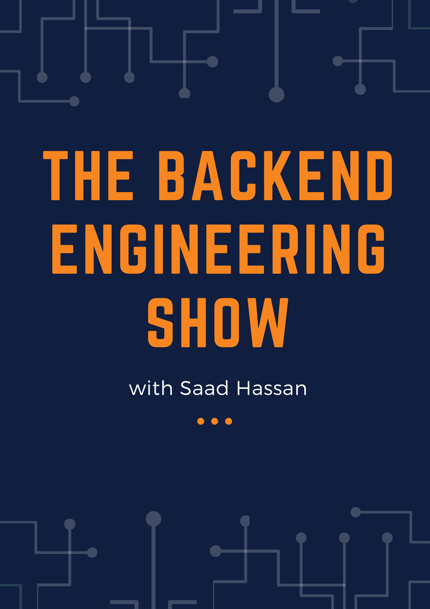

# Hi there, I'm Saad 👋

## My Backend Engineering Show
- [The Backend Engineering Show with Saad Hassan](https://www.youtube.com/playlist?list=PLx8CItc_kq60ORFN7NVaD2xae_WystDOa)

### I'm a Developer, Teacher, and Researcher!
- 🔭 I’m working as a Backend and infra Engineer with Typescript and Python.
- 🌱 I’m currently learning Spring Boot & Go.
- 👯 I’m looking to collaborate with other content creators and developers.
- 📢 Love to teach and inspire students. Taught more than 2k students.
- 🥅 2024 Goals: Contribute more to Open Source projects.

<h2><i>💻 Tech Stack and Tools</i></h2>

<table width="100">
<tr>
    <td align='center' width="190">
        
    </td>
    <td align='center' width="190">
        
    </td>
    <td align='center' width="190">
        
    </td>
     <td align='center' width="190">
        
    </td>
    <td align='center' width="190">
        
    </td>
</tr>
<tr>
    <td align='center'>
        
    </td>
    <td align='center'>
        
    </td>
    <td align='center'>
        
    </td>
    <td align='center'>
        
    </td>
    <td align='center'>
        
    </td>
</tr>
<tr>
    <td align='center'>
        
    </td>
    <td align='center'>
        
    </td>
    <td align='center'>
        
    </td>
    <td align='center'>
        
    </td>
    <td align='center'>
        
    </td>
</tr>
<tr>
    <td align='center'>
        
    </td>
    <td align='center'>
        
    </td>
    <td align='center'>
        
    </td>
    <td align='center'>
        
    </td>
    <td align='center'>
        
    </td>
</tr>
<tr>
    <td align='center'>
        
    </td>
    <td align='center'>
        
    </td>
    <td align='center'>
        
    </td>
    <td align='center'>
        
    </td>
    <td align='center'>
        
    </td>
</tr>

<tr>
    <td align='center'>
        
    </td>
    <td align='center'>
        
    </td>
    <td align='center'>
        
    </td>
    <td align='center'>
        
    </td>
    <td align='center'>
        
    </td>
</tr>
    
</table>

 
 

## 🤝🏻 &nbsp;Connect with Me

## Some Community Projects

|      Project :octocat:   |     Issues :bug:   | Open PRs :bell:  | Closed PRs :fire:  |
|-------------|-------------------|---|---|
| [**Awesome Python Projects**](https://github.com/saadhaxxan/Awesome-Python-Projects) |  |   |   |
| [**Learn_Machine_Learning_in_5_Months**](https://github.com/saadhaxxan/Learn_Machine_Learning_in_5_Months/) |  |   |    |
| [**Python For Ethical Hacking**](https://github.com/saadhaxxan/Python-For-Ethical-Hacking/) |  |   |    |
| [**Learn-Data-Science-in-3-months**](https://github.com/saadhaxxan/Learn-Data-Science-in-3-months) |  |   |    |
| [**Learn Blockchain in 3 months**](https://github.com/saadhaxxan/Learn-Blockchain-in-3-months) |  |   |    |
    
## My Activities :mailbox_with_mail:

| BOOTCAMPS & SESSIONS :tv: | 
| :--- |
| [Deep Learning with Tensorflow ](https://github.com/dscuol/Deep-Learning-Course) |
| [Machine Learning Course](https://github.com/dscuol/Machine-Learning-Course) |
| [Web Development Bootcamp](https://github.com/dscuol/Web-Development-Bootcamp) | 
| [Advanced Web Development Bootcamp](https://github.com/dscuol/Advanced-web-development-series) | 
| [NLP Bootcamp](https://github.com/dscuol/Natural-Language-Processing-Bootcamp) | 
| [DSA Bootcamp C++](https://github.com/saadhaxxan/DSA-Bootcamp-Cpp) | 

<h2><i>⚙️ GitHub Analytics</i></h2>

  

# Github Metrics

	

